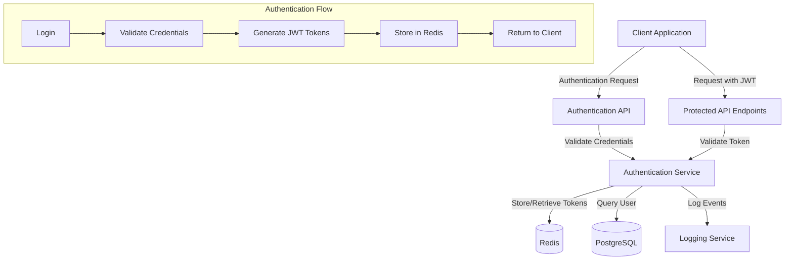
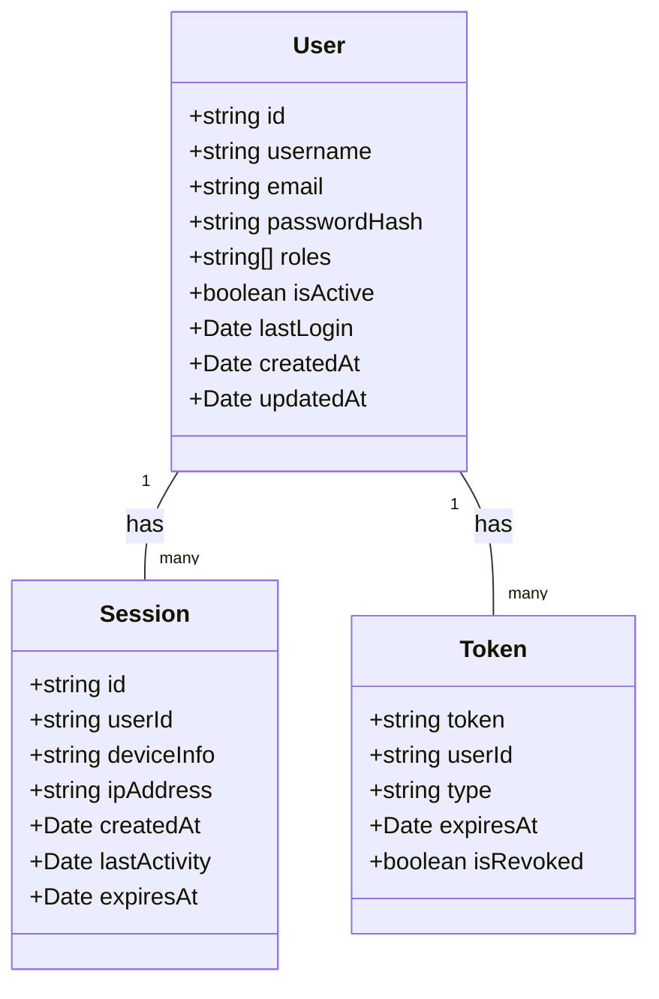

# Authentication & Authorization

## Overview

The Authentication & Authorization component manages user identity verification, session management, and access control throughout the ChainSync system. It provides secure, stateless authentication using JWT tokens with Redis-backed persistence for improved reliability and scalability.

## Responsibilities

- User authentication and identity verification
- Session creation, management, and termination
- Token issuance, validation, and revocation
- Role-based access control
- Security event logging and monitoring
- Protection against common authentication attacks

## Architecture

## Key Interfaces

| Interface | Description | Consumers |
|-----------|-------------|-----------|
| `authenticate(credentials)` | Authenticates a user and returns JWT tokens | API Gateway, Login Endpoints |
| `validateToken(token)` | Validates a JWT token and returns user information | All protected API endpoints |
| `refreshToken(refreshToken)` | Issues a new access token using a refresh token | Token refresh endpoint |
| `revokeToken(token)` | Invalidates a specific token | Logout endpoint, security features |
| `revokeAllUserTokens(userId)` | Invalidates all tokens for a specific user | Account security features |

## Data Model

## Dependencies

| Dependency | Purpose | Type |
|------------|---------|------|
| Redis | Token and session storage with TTL capabilities | External |
| PostgreSQL/Drizzle ORM | User data storage and retrieval | Internal |
| JWT Library | Token generation and validation | Library |
| bcrypt | Password hashing and verification | Library |
| Logging Service | Security event logging | Internal |

## Redis Data Structure

The authentication service uses Redis for token and session storage with the following key structure:

| Key Pattern | Purpose | TTL |
|-------------|---------|-----|
| `auth:token:{tokenId}` | Stores token metadata and validation status | Token expiration time |
| `auth:session:{sessionId}` | Stores session data including device and activity info | Session expiration time |
| `auth:user:{userId}:tokens` | Set of token IDs associated with a user | None (managed manually) |
| `auth:user:{userId}:sessions` | Set of session IDs associated with a user | None (managed manually) |

## Configuration

| Configuration | Description | Default | Environment Variable |
|---------------|-------------|---------|---------------------|
| JWT Secret | Secret key for signing JWTs | N/A (Required) | `JWT_SECRET` |
| JWT Refresh Secret | Secret key for signing refresh tokens | N/A (Required) | `JWT_REFRESH_SECRET` |
| Access Token TTL | Lifetime of access tokens | 15 minutes | `JWT_ACCESS_TTL` |
| Refresh Token TTL | Lifetime of refresh tokens | 7 days | `JWT_REFRESH_TTL` |
| Redis URL | Connection string for Redis | N/A (Required) | `REDIS_URL` |
| Session Timeout | Inactive session timeout | 30 minutes | `SESSION_TIMEOUT` |

## Error Handling

The authentication service uses standardized error codes and messaging:

| Error Code | Description | HTTP Status |
|------------|-------------|-------------|
| `AUTH_INVALID_CREDENTIALS` | Invalid username or password | 401 |
| `AUTH_EXPIRED_TOKEN` | Token has expired | 401 |
| `AUTH_INVALID_TOKEN` | Token is invalid or malformed | 401 |
| `AUTH_REVOKED_TOKEN` | Token has been revoked | 401 |
| `AUTH_INSUFFICIENT_PERMISSIONS` | User lacks required permissions | 403 |
| `AUTH_USER_INACTIVE` | User account is inactive | 403 |
| `AUTH_SERVICE_ERROR` | Internal authentication service error | 500 |

## Resilience Patterns

The authentication service implements several resilience patterns:

1. **Redis Fallback**: If Redis is temporarily unavailable, the service falls back to JWT validation without token revocation checking, logging the event for later reconciliation.

2. **Token Refresh Strategy**: Clients use short-lived access tokens and longer-lived refresh tokens to maintain sessions while limiting exposure.

3. **Rate Limiting**: Authentication endpoints implement rate limiting to prevent brute force attacks.

4. **Circuit Breaker**: Service dependencies use circuit breakers to prevent cascading failures.

## Security Considerations

1. **Token Security**:
   - JWTs are signed with strong secrets
   - Tokens have appropriate expiration times
   - Access tokens have limited scopes
   - Refresh tokens are single-use and rotated

2. **Password Security**:
   - Passwords are hashed using bcrypt with appropriate work factors
   - Password strength requirements are enforced
   - Failed login attempts are limited and logged

3. **Session Security**:
   - Sessions track device information and IP address
   - Suspicious session activity triggers security alerts
   - Sessions can be remotely terminated by administrators

## Testing Strategy

1. **Unit Tests**:
   - Test each authentication method in isolation
   - Mock Redis and database dependencies
   - Test error handling and edge cases

2. **Integration Tests**:
   - Test authentication flow with real dependencies
   - Test token refresh and revocation

3. **Security Tests**:
   - Vulnerability scanning
   - Penetration testing
   - Token tampering attempts

## Related Documentation

- [ADR-002: Redis for Token Storage](../adrs/002-redis-for-token-storage.md)
- [Security Overview](./security.md)
- [API Authentication Guide](../../guides/api-authentication.md)
