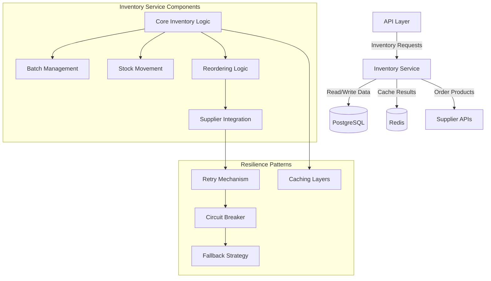
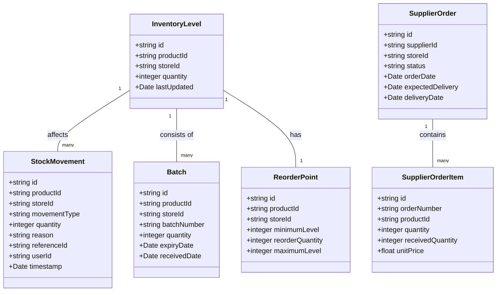

# Inventory Management

## Overview

The Inventory Management component is responsible for tracking product inventory across all stores, managing stock movements, batch processing, and supplier integrations. It implements resilient patterns to ensure reliability even during transient failures or when external supplier APIs are unavailable.

## Responsibilities

- Maintain accurate inventory levels across all stores
- Track stock movements (receipts, sales, transfers, adjustments)
- Manage product batches and expiration dates
- Process low stock alerts and reorder suggestions
- Integrate with supplier systems for automated ordering
- Provide inventory reporting and analytics data
- Support inventory audits and reconciliation

## Architecture

## Key Interfaces

| Interface | Description | Consumers |
|-----------|-------------|-----------|
| `getInventoryLevel(productId, storeId)` | Get current inventory level for a product at a store | POS, Admin Dashboard, Analytics |
| `updateInventoryLevel(productId, storeId, quantity, reason)` | Update inventory level with audit trail | Transaction Service, Admin Dashboard |
| `transferStock(fromStoreId, toStoreId, items)` | Transfer stock between stores | Store Management, Admin Dashboard |
| `receiveStock(storeId, supplierOrderId, items)` | Receive stock from supplier | Store Management, Supplier Integration |
| `createStockAdjustment(storeId, items, reason)` | Create inventory adjustment with reason | Admin Dashboard, Audit Process |
| `getStockMovements(filters)` | Get history of stock movements | Admin Dashboard, Analytics |
| `checkLowStock(storeId)` | Check for products below reorder level | Automated Processes, Admin Dashboard |
| `createSupplierOrder(storeId, items)` | Create order to supplier | Admin Dashboard, Automated Processes |

## Data Model

## Dependencies

| Dependency | Purpose | Type |
|------------|---------|------|
| PostgreSQL/Drizzle ORM | Primary data storage | External |
| Redis | Caching inventory levels and query results | External |
| Supplier APIs | Integration with supplier ordering systems | External |
| Product Service | Product information and categorization | Internal |
| Transaction Service | Sales-related inventory changes | Internal |
| Store Service | Store information and configuration | Internal |
| Logging Service | Activity and error logging | Internal |
| Notification Service | Low stock and order notifications | Internal |

## Caching Strategy

The inventory service implements a multi-level caching strategy:

| Cache Key Pattern | Purpose | TTL |
|-------------------|---------|-----|
| `inventory:level:{storeId}:{productId}` | Current inventory level | 5 minutes |
| `inventory:lowstock:{storeId}` | Products below reorder point | 15 minutes |
| `inventory:movement:{storeId}:{timeframe}` | Recent stock movements | 30 minutes |
| `inventory:supplier:{supplierId}` | Supplier information | 1 hour |

Cache invalidation occurs:
- After any inventory update operation
- On batch receipts and adjustments
- When supplier information changes

## Configuration

| Configuration | Description | Default | Environment Variable |
|---------------|-------------|---------|---------------------|
| Low Stock Threshold | Default percentage for low stock alerting | 20% | `INVENTORY_LOW_STOCK_THRESHOLD` |
| Reorder Lead Time | Default days for reorder lead time | 7 days | `INVENTORY_REORDER_LEAD_TIME` |
| Stock Count Frequency | Default days between suggested stock counts | 30 days | `INVENTORY_STOCK_COUNT_FREQUENCY` |
| Supplier API Timeout | Timeout for supplier API calls | 5 seconds | `SUPPLIER_API_TIMEOUT` |
| Supplier API Retry Attempts | Number of retry attempts for supplier APIs | 3 | `SUPPLIER_API_RETRY_ATTEMPTS` |

## Resilience Patterns

The inventory service implements several resilience patterns:

1. **Retry Mechanism**: Automatically retries failed operations with supplier APIs using exponential backoff and jitter.

2. **Circuit Breaker**: Prevents cascading failures by temporarily disabling supplier API calls after a threshold of failures.

3. **Fallback Strategy**: When supplier APIs are unavailable, orders are queued for later processing and manual ordering options are provided.

4. **Caching Layer**: Maintains cache of recent inventory data to serve requests even when database access is degraded.

5. **Transaction Management**: Uses proper isolation levels and automatic retries for handling transient database errors.

6. **Batch Processing**: Implements batch processing for large inventory operations to prevent resource exhaustion.

## Error Handling

The inventory service uses standardized error codes and messaging:

| Error Code | Description | HTTP Status |
|------------|-------------|-------------|
| `INVENTORY_NOT_FOUND` | Inventory record not found | 404 |
| `INVENTORY_INSUFFICIENT_STOCK` | Insufficient stock for operation | 400 |
| `INVENTORY_INVALID_MOVEMENT` | Invalid stock movement type or data | 400 |
| `INVENTORY_SUPPLIER_UNAVAILABLE` | Supplier API is unavailable | 503 |
| `INVENTORY_DATABASE_ERROR` | Database error during inventory operation | 500 |
| `INVENTORY_BATCH_EXPIRED` | Operation attempted on expired batch | 400 |
| `INVENTORY_VALIDATION_ERROR` | Validation error in inventory data | 400 |

## Performance Considerations

1. **Query Optimization**:
   - Strategic indexes on inventory tables
   - Optimized queries for frequent inventory lookups
   - Batch operations for bulk updates

2. **Caching Strategy**:
   - Multi-level caching for inventory levels
   - Cached query results for common reports
   - Intelligent cache invalidation

3. **Background Processing**:
   - Asynchronous processing for non-critical operations
   - Scheduled jobs for inventory reconciliation
   - Batched supplier order processing

## Security Considerations

1. **Access Control**:
   - Role-based permissions for inventory operations
   - Audit trails for all stock movements
   - Restricted access to supplier order functionality

2. **Data Validation**:
   - Input validation for all inventory operations
   - Proper sanitization of external supplier data
   - Business rule validation for inventory movements

3. **API Security**:
   - Secure communication with supplier APIs
   - API keys and credentials stored securely
   - Rate limiting for external API calls

## Testing Strategy

1. **Unit Tests**:
   - Test each inventory operation in isolation
   - Mock external dependencies
   - Test error handling and edge cases

2. **Integration Tests**:
   - Test inventory workflows with real dependencies
   - Test supplier API integration with mocked responses
   - Test database interactions and transactions

3. **Performance Tests**:
   - Load testing for high-volume inventory operations
   - Benchmark common inventory queries
   - Test caching effectiveness

## Related Documentation

- [ADR-001: Service Standardization Pattern](../adrs/001-service-standardization-pattern.md)
- [ADR-003: Resilience Patterns](../adrs/003-resilience-patterns.md)
- [Product Management](./product-management.md)
- [Supplier Integration Guide](../../guides/supplier-integration.md)
