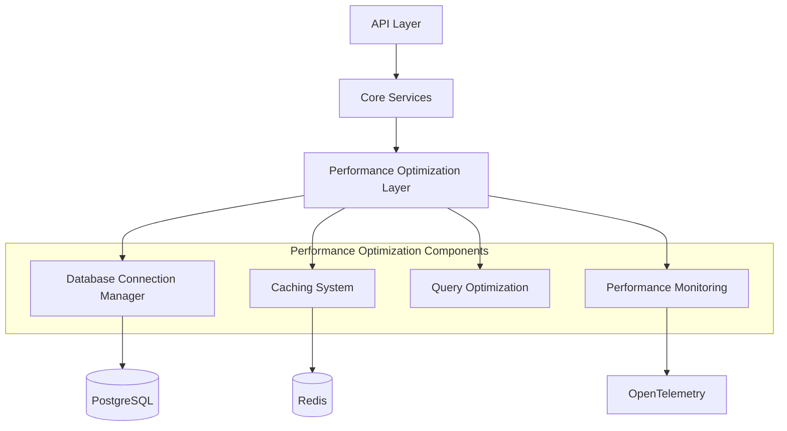
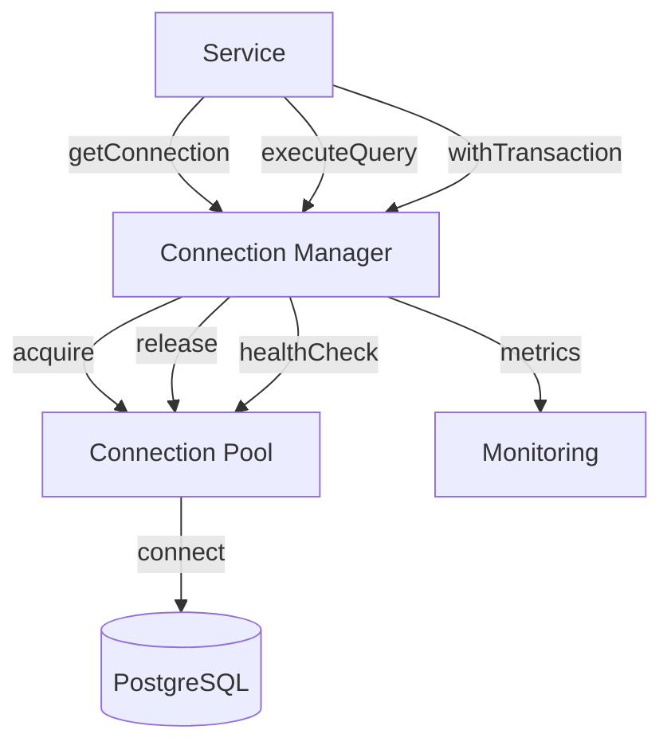
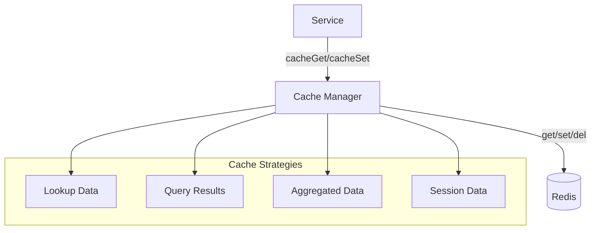
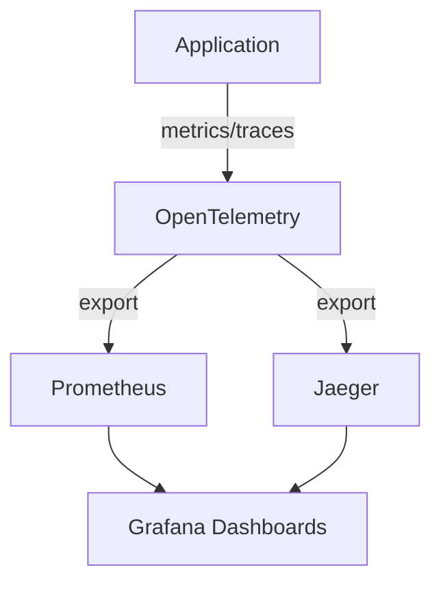
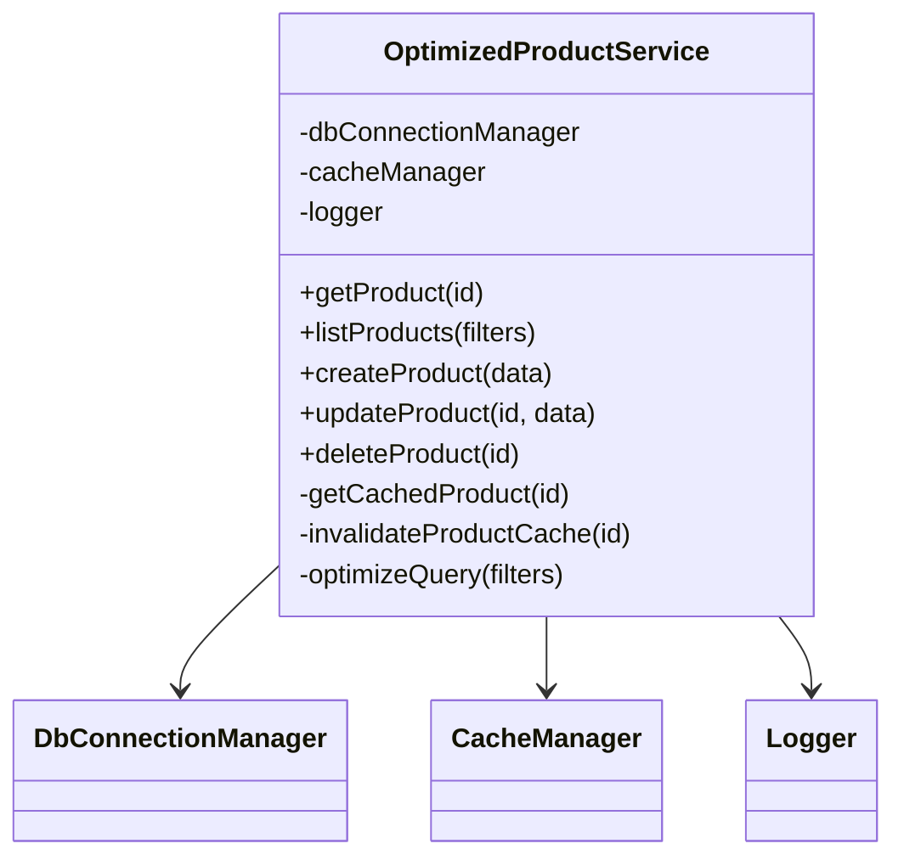

# Performance Optimization

## Overview

The Performance Optimization component provides tools, patterns, and infrastructure for optimizing the performance of the ChainSync system. It includes database connection pooling, strategic caching, query optimization, and monitoring capabilities to ensure the application can handle production workloads efficiently.

## Responsibilities

- Manage database connections efficiently through connection pooling
- Implement and manage caching strategies for frequently accessed data
- Optimize database queries and schema for performance
- Monitor and track performance metrics across the system
- Provide tools for identifying and resolving performance bottlenecks
- Ensure graceful degradation under high load

## Architecture

## Key Interfaces

| Interface                     | Description                               | Consumers                          |
| ----------------------------- | ----------------------------------------- | ---------------------------------- |
| `getConnection()`             | Get a database connection from the pool   | All database-accessing services    |
| `executeQuery(query, params)` | Execute a query with performance tracking | Services, DAOs                     |
| `withTransaction(callback)`   | Execute a callback within a transaction   | Services requiring transactions    |
| `cacheGet(key)`               | Retrieve data from cache                  | Services with caching needs        |
| `cacheSet(key, value, ttl)`   | Store data in cache with TTL              | Services with caching needs        |
| `cacheInvalidate(pattern)`    | Invalidate cache entries by pattern       | Services after data mutations      |
| `recordMetric(name, value)`   | Record a custom performance metric        | Any component tracking performance |

## Database Connection Management

The Database Connection Manager provides centralized management of database connections:

### Connection Pooling Strategy

| Parameter          | Description                                  | Default Value | Environment Variable       |
| ------------------ | -------------------------------------------- | ------------- | -------------------------- |
| Min Connections    | Minimum connections in pool                  | 5             | `DB_POOL_MIN`              |
| Max Connections    | Maximum connections in pool                  | 20            | `DB_POOL_MAX`              |
| Idle Timeout       | Time after which idle connections are closed | 30s           | `DB_POOL_IDLE_TIMEOUT`     |
| Connection Timeout | Max time to wait for connection              | 5s            | `DB_POOL_CONN_TIMEOUT`     |
| Validation Query   | Query to validate connections                | `SELECT 1`    | `DB_POOL_VALIDATION_QUERY` |

### Query Performance Tracking

The system tracks query performance with the following metrics:

- Query execution time
- Query frequency
- Query patterns (similar queries grouped)
- Slow query identification (configurable threshold)
- Query error rates

## Caching System

The caching system uses Redis to store frequently accessed data with appropriate TTLs:

### Cache Key Strategies

| Entity Type        | Key Pattern                       | TTL        | Invalidation Strategy       |
| ------------------ | --------------------------------- | ---------- | --------------------------- |
| Product Data       | `product:{id}`                    | 1 hour     | On product update           |
| Category Data      | `category:{id}`                   | 2 hours    | On category update          |
| Inventory Levels   | `inventory:{storeId}:{productId}` | 5 minutes  | On inventory change         |
| User Profiles      | `user:{id}`                       | 30 minutes | On profile update           |
| Query Results      | `query:{hash}`                    | 15 minutes | Time-based or explicit      |
| Lookup Data        | `lookup:{type}`                   | 24 hours   | On reference data update    |
| Aggregated Metrics | `metrics:{type}:{timeframe}`      | Varies     | Time-based or recalculation |

### Cache Invalidation Patterns

The system uses the following cache invalidation strategies:

1. **Key-based invalidation**: Explicit deletion of keys when data changes
2. **Pattern-based invalidation**: Deletion of keys matching a pattern
3. **Time-based expiration**: TTL-based automatic expiration
4. **Version-based invalidation**: Keys include a version component that changes on updates

## Database Optimization

### Database Indexing Strategy

The system implements strategic database indexes for frequently accessed tables:

| Table            | Index                       | Type   | Purpose                               |
| ---------------- | --------------------------- | ------ | ------------------------------------- |
| products         | idx_products_category       | B-tree | Product listing by category           |
| inventory_levels | idx_inventory_store_product | B-tree | Inventory lookup by store and product |
| transactions     | idx_transactions_store_date | B-tree | Transaction queries by store and date |
| loyalty_members  | idx_loyalty_customer        | B-tree | Loyalty lookup by customer            |
| users            | idx_users_email             | B-tree | User lookup by email                  |
| stock_movements  | idx_movements_product_date  | B-tree | Stock movement history by product     |

### Query Optimization Techniques

1. **Query Rewriting**: Optimization of frequently executed queries
2. **Selective Columns**: Retrieving only needed columns
3. **Join Optimization**: Proper join strategies and order
4. **Pagination**: Consistent use of limit/offset or keyset pagination
5. **Aggregate Optimization**: Efficient handling of aggregation queries

## Performance Monitoring

The performance monitoring system uses OpenTelemetry to collect and analyze performance data:

### Key Performance Metrics

| Metric                      | Description                                 | Alert Threshold |
| --------------------------- | ------------------------------------------- | --------------- |
| API Response Time           | Average response time for API endpoints     | > 500ms         |
| Database Query Time         | Average database query execution time       | > 100ms         |
| Slow Query Count            | Number of queries exceeding threshold       | > 10 per minute |
| Cache Hit Rate              | Percentage of cache hits vs. misses         | < 80%           |
| Connection Pool Utilization | Percentage of pool in use                   | > 90%           |
| API Error Rate              | Percentage of API calls resulting in errors | > 1%            |
| Database Connection Errors  | Count of database connection failures       | > 0             |

## Optimized Service Implementation

The performance optimization patterns are demonstrated in the optimized ProductService implementation:

### Performance Patterns in Services

The optimized service implementations use the following patterns:

1. **Selective Data Loading**: Loading only required data
2. **Strategic Caching**: Caching frequently accessed data
3. **Cache Invalidation**: Proper invalidation on data changes
4. **Query Optimization**: Using optimized query patterns
5. **Connection Management**: Proper connection handling
6. **Batch Operations**: Batching multiple operations
7. **Async Processing**: Moving non-critical operations to background

## Graceful Shutdown

The system implements graceful shutdown procedures to ensure in-flight operations complete successfully:

1. **Connection Draining**: Allowing existing operations to complete
2. **Query Cancellation**: Canceling long-running queries if necessary
3. **Cache Persistence**: Ensuring cache data is persisted if needed
4. **Metric Flushing**: Ensuring all metrics are sent before shutdown

## Dependencies

| Dependency    | Purpose                | Type     |
| ------------- | ---------------------- | -------- |
| PostgreSQL    | Primary data storage   | External |
| Drizzle ORM   | Database access layer  | Library  |
| Redis         | Caching infrastructure | External |
| OpenTelemetry | Performance monitoring | Library  |
| Prometheus    | Metrics storage        | External |
| Grafana       | Metrics visualization  | External |

## Configuration

| Configuration        | Description                      | Default | Environment Variable   |
| -------------------- | -------------------------------- | ------- | ---------------------- |
| DB Pool Size         | Database connection pool size    | 20      | `DB_POOL_SIZE`         |
| Query Timeout        | Maximum query execution time     | 30s     | `DB_QUERY_TIMEOUT`     |
| Slow Query Threshold | Threshold for slow query logging | 1000ms  | `SLOW_QUERY_THRESHOLD` |
| Cache TTL Default    | Default TTL for cached items     | 3600s   | `CACHE_DEFAULT_TTL`    |
| Redis Connection     | Redis connection string          | N/A     | `REDIS_URL`            |
| Telemetry Enabled    | Whether telemetry is enabled     | true    | `TELEMETRY_ENABLED`    |

## Error Handling

The performance optimization component handles errors gracefully:

1. **Connection Failures**: Automatic retry with exponential backoff
2. **Pool Exhaustion**: Queuing requests with timeout
3. **Cache Failures**: Fallback to database with logging
4. **Query Timeouts**: Cancellation with appropriate error response
5. **Monitoring Failures**: Local buffering with eventual consistency

## Performance Considerations

1. **Connection Pool Sizing**:

   - Size based on expected concurrent users
   - Monitor for pool exhaustion events
   - Adjust based on actual usage patterns

2. **Cache Size and Eviction**:

   - Monitor cache memory usage
   - Implement appropriate eviction policies
   - Balance between cache size and hit rate

3. **Query Optimization**:
   - Regular review of slow queries
   - Index optimization based on query patterns
   - Query rewriting for problematic patterns

## Testing Strategy

1. **Load Testing**:

   - Simulated production load patterns
   - Concurrent user simulation
   - Benchmark against performance targets

2. **Performance Profiling**:

   - CPU and memory profiling
   - Database query analysis
   - I/O and network bottleneck identification

3. **Chaos Testing**:
   - Simulated resource constraints
   - Dependency failure injection
   - Recovery time measurement

## Related Documentation

- [ADR-004: Database Connection Pooling](../adrs/004-database-connection-pooling.md)
- [Database Schema Documentation](../../database/schema.md)
- [Caching Strategy Guide](../../guides/caching-strategy.md)
- [Performance Monitoring Guide](../../guides/performance-monitoring.md)
