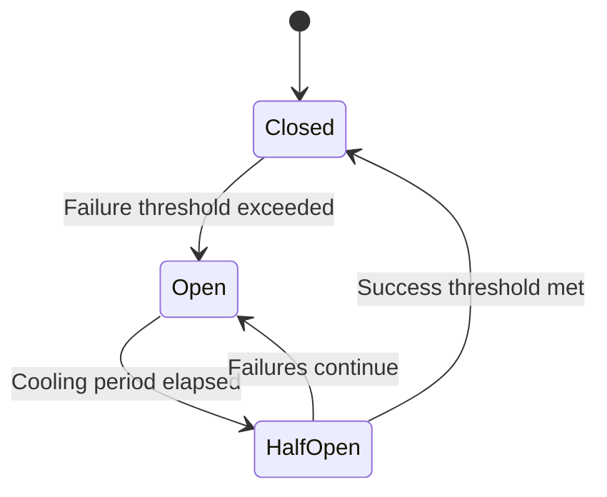

# Reliability & Resilience

## Overview

The Reliability & Resilience component provides patterns, utilities, and infrastructure to ensure the ChainSync system can maintain service availability and recover gracefully from failures. It implements industry-standard resilience patterns including retry mechanisms, circuit breakers, fallback strategies, and transaction reliability to prevent cascading failures and ensure a stable user experience even during partial system degradation.

## Responsibilities

- Implement retry mechanisms for transient failures
- Prevent cascading failures through circuit breaker patterns
- Provide fallback strategies when primary functionality is unavailable
- Ensure reliable HTTP communication with external services
- Enhance database transaction reliability
- Support graceful degradation of functionality
- Enable monitoring and manual intervention for resilience features

## Architecture


## Key Interfaces

| Interface | Description | Consumers |
|-----------|-------------|-----------|
| `retry<T>(fn, options)` | Execute function with retry policy | Services with retryable operations |
| `withCircuitBreaker<T>(fn, options)` | Execute function with circuit breaker protection | Services calling external dependencies |
| `withFallback<T>(primaryFn, fallbackFn)` | Execute with fallback if primary fails | Services needing degraded operation |
| `httpClient.request(config)` | Make HTTP request with resilience features | Services calling external APIs |
| `withReliableTransaction<T>(fn, options)` | Execute function in reliable transaction | Services with critical database operations |

## Retry Utility

The Retry Utility provides configurable retry policies for handling transient failures:


### Retry Policies

| Policy | Description | Use Cases |
|--------|-------------|-----------|
| `exponentialBackoff` | Exponential delay between retries | External API calls |
| `linearBackoff` | Fixed delay between retries | Database operations |
| `randomizedBackoff` | Randomized delay to prevent thundering herd | High-concurrency operations |
| `custom` | Custom retry strategy | Special case scenarios |

### Retry Configuration Options

| Option | Description | Default |
|--------|-------------|---------|
| `maxAttempts` | Maximum number of retry attempts | 3 |
| `initialDelay` | Initial delay before first retry | 100ms |
| `maxDelay` | Maximum delay between retries | 5000ms |
| `backoffFactor` | Multiplier for exponential backoff | 2 |
| `jitter` | Random factor to add to delay | 0.1 |
| `retryableErrors` | Errors that should trigger retry | Network errors, 5xx responses |

## Circuit Breaker

The Circuit Breaker prevents cascading failures by stopping calls to failing services:



### Circuit Breaker States

| State | Description | Behavior |
|-------|-------------|----------|
| `Closed` | Normal operation | Calls pass through normally |
| `Open` | Circuit tripped | Calls fail fast with CircuitBreakerOpenError |
| `Half-Open` | Testing recovery | Limited calls allowed to test service health |

### Circuit Breaker Configuration

| Option | Description | Default |
|--------|-------------|---------|
| `failureThreshold` | Number of failures before opening | 5 |
| `failureRateThreshold` | Percentage of failures to trigger opening | 50% |
| `successThreshold` | Successes in half-open state to close | 3 |
| `resetTimeout` | Time before half-open state | 30s |
| `monitorInterval` | How often to check circuit state | 5s |

## Fallback Strategies

The Fallback Manager provides alternative functionality when primary operations fail:


### Fallback Types

| Type | Description | Use Cases |
|------|-------------|-----------|
| `cacheFallback` | Return cached data | When live data unavailable |
| `degradedFallback` | Return limited functionality | When full function unavailable |
| `staticFallback` | Return static default data | When dynamic data unavailable |
| `queueFallback` | Queue for later processing | When processing service down |

## Resilient HTTP Client

The Resilient HTTP Client combines retry, circuit breaking, and fallback for external API calls:


### HTTP Client Features

| Feature | Description | Configuration |
|---------|-------------|---------------|
| Automatic Retry | Retry transient failures | Configure retry policy |
| Circuit Breaking | Circuit breaker per endpoint | Configure thresholds |
| Timeout Management | Request and connection timeouts | Configure timeouts |
| Fallback URLs | Alternative endpoints | Configure fallback URLs |
| Response Validation | Validate response structure | Configure validators |
| Metrics Collection | Track request performance | Automatic |

## Database Transaction Reliability

The Transaction Manager enhances database transaction reliability:


### Transaction Features

| Feature | Description | Configuration |
|---------|-------------|---------------|
| Automatic Retry | Retry on deadlock or connection issue | Configure retry policy |
| Isolation Levels | Appropriate isolation for operation | Set per transaction |
| Savepoints | Partial rollback support | Available in API |
| Connection Management | Proper connection handling | Automatic |
| Transaction Timeout | Prevent long-running transactions | Configure timeout |

## Implementation Examples

### ResilientInventoryService Example

```typescript
// Example showing resilience patterns in the Inventory Service
async updateInventoryLevel(productId: string, storeId: string, quantity: number): Promise<ServiceResult<InventoryLevel>> {
  return this.withCircuitBreaker(
    'inventory-update',
    async () => {
      return this.retry(
        async () => {
          return this.withReliableTransaction(async (tx) => {
            // Update inventory logic
            const result = await this.db.update(...);
            
            // Invalidate cache after successful update
            await this.cacheManager.invalidate(`inventory:${storeId}:${productId}`);
            
            return result;
          }, { isolation: 'serializable' });
        },
        { maxAttempts: 3, retryableErrors: [ErrorCode.DB_DEADLOCK, ErrorCode.DB_CONNECTION_ERROR] }
      );
    },
    { fallback: async () => this.getInventoryLevelFromCache(productId, storeId) }
  );
}
```

### HTTP Client Example

```typescript
// Example showing resilient HTTP client usage
async getSupplierInventory(supplierId: string): Promise<SupplierInventory> {
  try {
    const result = await this.resilientHttpClient.request({
      url: `${this.supplierApiUrl}/inventory/${supplierId}`,
      method: 'GET',
      retry: {
        maxAttempts: 3,
        backoff: 'exponential',
      },
      circuitBreaker: {
        name: `supplier-${supplierId}`,
      },
      fallbackUrl: `${this.backupSupplierApiUrl}/inventory/${supplierId}`,
      timeout: 5000,
    });
    
    return result.data;
  } catch (error) {
    if (error instanceof CircuitBreakerOpenError) {
      return this.getSupplierInventoryFromCache(supplierId);
    }
    throw error;
  }
}
```

## Monitoring and Observability

The resilience components provide extensive monitoring capabilities:

| Metric | Description | Alert Threshold |
|--------|-------------|----------------|
| `retry.attempts` | Number of retry attempts | > 100 per minute |
| `retry.success_after_retry` | Operations succeeding after retry | N/A (informational) |
| `circuit.state` | Circuit breaker state | Open state |
| `circuit.failure_rate` | Failure rate for circuit | > 30% |
| `fallback.invocations` | Number of fallback invocations | > 50 per minute |
| `http.request_failures` | Failed HTTP requests | > 10% failure rate |
| `transaction.retries` | Transaction retry attempts | > 20 per minute |

## Dependencies

| Dependency | Purpose | Type |
|------------|---------|------|
| Logging System | Error and activity logging | Internal |
| Monitoring System | Performance and state metrics | Internal |
| Cache System | Support for cache fallbacks | Internal |
| Database | Transaction management | External |
| HTTP Client | Base HTTP client functionality | Library |

## Configuration

| Configuration | Description | Default | Environment Variable |
|---------------|-------------|---------|---------------------|
| Retry Max Attempts | Default max retry attempts | 3 | `RETRY_MAX_ATTEMPTS` |
| Circuit Failure Threshold | Default circuit failure threshold | 5 | `CIRCUIT_FAILURE_THRESHOLD` |
| Circuit Reset Timeout | Default circuit reset timeout | 30s | `CIRCUIT_RESET_TIMEOUT` |
| HTTP Timeout | Default HTTP request timeout | 5s | `HTTP_TIMEOUT` |
| Transaction Retry Limit | Default transaction retry limit | 3 | `TRANSACTION_RETRY_LIMIT` |

## Error Handling

The resilience components use the following error types:

| Error Type | Description | Handling Strategy |
|------------|-------------|-------------------|
| `RetryExhaustedError` | Max retry attempts reached | Log, alert, fallback |
| `CircuitBreakerOpenError` | Circuit breaker is open | Log, use fallback |
| `FallbackFailedError` | Fallback operation failed | Log, alert, degrade service |
| `HttpRequestFailedError` | HTTP request failed | Log, analyze failure cause |
| `TransactionFailedError` | Transaction failed | Log, analyze failure pattern |

## Testing Strategy

1. **Unit Testing**:
   - Test retry logic with mock failures
   - Test circuit breaker state transitions
   - Test fallback behavior
   
2. **Integration Testing**:
   - Test resilience against real dependencies
   - Test recovery from simulated failures
   - Test behavior under load
   
3. **Chaos Testing**:
   - Inject random failures
   - Simulate dependency outages
   - Measure recovery time

## Related Documentation

- [ADR-003: Resilience Patterns](../adrs/003-resilience-patterns.md)
- [Resilient Service Implementation Guide](../../guides/resilient-service-implementation.md)
- [Error Handling Patterns](../../guides/error-handling-patterns.md)
- [External Integration Strategy](../../guides/external-integration-strategy.md)
