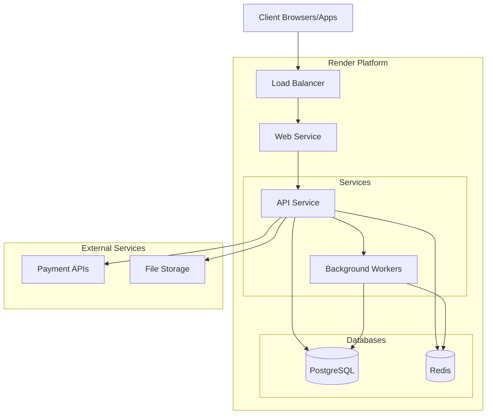

# ChainSync System Architecture Overview

## Introduction

ChainSync is a comprehensive retail chain management system designed to provide end-to-end solutions for managing retail stores, inventory, sales, customers, and analytics. The system is built with a modular architecture to support scalability, maintainability, and reliability.

## System Architecture Diagram

```mermaid
graph TD
    subgraph "Frontend Applications"
        POS[Point of Sale]
        Admin[Admin Dashboard]
        Mobile[Mobile App]
    end

    subgraph "API Layer"
        API[REST API Gateway]
        WS[WebSocket Server]
        Auth[Authentication]
    end

    subgraph "Core Services"
        Store[Store Management]
        Inventory[Inventory Management]
        Product[Product Management]
        Transaction[Transaction Processing]
        Customer[Customer Management]
        Loyalty[Loyalty Program]
        Subscription[Subscription Management]
        Analytics[Analytics & Reporting]
    end

    subgraph "Cross-Cutting Concerns"
        Security[Security]
        Reliability[Reliability & Resilience]
        Performance[Performance Optimization]
        Monitoring[Monitoring & Observability]
    end

    subgraph "External Integrations"
        Payment[Payment Processors]
        Supplier[Supplier APIs]
        ExtAnalytics[External Analytics]
    end

    subgraph "Data Storage"
        DB[(PostgreSQL)]
        Cache[(Redis)]
        FileStorage[(File Storage)]
    end

    POS --> API
    POS --> WS
    Admin --> API
    Mobile --> API
    Mobile --> WS

    API --> Auth
    WS --> Auth

    API --> Store
    API --> Inventory
    API --> Product
    API --> Transaction
    API --> Customer
    API --> Loyalty
    API --> Subscription
    API --> Analytics

    Store --> DB
    Inventory --> DB
    Product --> DB
    Transaction --> DB
    Customer --> DB
    Loyalty --> DB
    Subscription --> DB
    Analytics --> DB

    Store --> Cache
    Inventory --> Cache
    Product --> Cache
    Transaction --> Cache
    Customer --> Cache
    Loyalty --> Cache
    Subscription --> Cache
    Analytics --> Cache

    Product --> FileStorage

    Transaction --> Payment
    Subscription --> Payment
    Inventory --> Supplier
    Analytics --> ExtAnalytics

    Security -.- API
    Security -.- WS
    Reliability -.- Core Services
    Performance -.- Core Services
    Monitoring -.- Core Services
```

## Technology Stack

| Component      | Technology                         |
| -------------- | ---------------------------------- |
| Frontend       | React, TypeScript, Tailwind CSS    |
| API            | Express.js, TypeScript             |
| Database       | PostgreSQL, Drizzle ORM            |
| Caching        | Redis                              |
| Authentication | JWT, Redis for session storage     |
| Messaging      | WebSocket                          |
| Testing        | Jest, Playwright                   |
| CI/CD          | GitHub Actions                     |
| Hosting        | Render                             |
| Monitoring     | OpenTelemetry, Prometheus, Grafana |

## Key Architectural Principles

1. **Modularity**: The system is divided into distinct, loosely coupled modules with clear responsibilities.

2. **Service-Oriented Architecture**: Functionality is exposed through well-defined service interfaces.

3. **Resilience**: The system implements patterns for handling failures gracefully, including retry mechanisms, circuit breakers, and fallback strategies.

4. **Performance**: Performance optimization is achieved through connection pooling, caching, query optimization, and monitoring.

5. **Security**: Security is implemented at multiple layers, including authentication, authorization, input validation, and rate limiting.

6. **Observability**: Comprehensive monitoring and logging provide visibility into system behavior and performance.

## Core Subsystems

### Frontend Applications

The system includes multiple frontend applications:

- **Point of Sale (POS)**: Used by cashiers for in-store sales processing
- **Admin Dashboard**: Used by store managers and administrators for management tasks
- **Mobile App**: Used by customers for loyalty program access and store information

### API Layer

The API layer provides access to the system's functionality:

- **REST API Gateway**: Handles HTTP requests for all system operations
- **WebSocket Server**: Provides real-time updates for POS and mobile applications
- **Authentication**: Manages user identity and access control

### Core Services

The core business functionality is provided by the following services:

- **Store Management**: Manages store information, locations, and configurations
- **Inventory Management**: Tracks product inventory, stock movements, and batches
- **Product Management**: Manages product definitions, categories, prices, and attributes
- **Transaction Processing**: Handles sales transactions, returns, and payments
- **Customer Management**: Manages customer profiles and purchase history
- **Loyalty Program**: Handles loyalty points, rewards, and tiers
- **Subscription Management**: Manages recurring subscriptions and billing
- **Analytics & Reporting**: Provides business intelligence and reporting

### Cross-Cutting Concerns

These concerns apply across the entire system:

- **Security**: Provides authentication, authorization, and other security controls
- **Reliability & Resilience**: Implements patterns for handling failures
- **Performance Optimization**: Provides tools for optimizing system performance
- **Monitoring & Observability**: Provides visibility into system behavior

### External Integrations

The system integrates with external services:

- **Payment Processors**: Handles payment processing through Paystack and Flutterwave
- **Supplier APIs**: Integrates with supplier systems for inventory management
- **External Analytics**: Provides data to external analytics services

### Data Storage

The system uses multiple data storage mechanisms:

- **PostgreSQL**: Primary relational database for structured data
- **Redis**: Used for caching and session storage
- **File Storage**: Used for storing product images and other assets

## Deployment Architecture

ChainSync is deployed on Render using a containerized architecture:



## Next Steps

For detailed information about each component, please refer to the component-specific documentation:

- [Authentication & Authorization](./components/authentication.md)
- [Store Management](./components/store-management.md)
- [Inventory Management](./components/inventory-management.md)
- [Product Management](./components/product-management.md)
- [Transaction Processing](./components/transaction-processing.md)
- [Customer Management](./components/customer-management.md)
- [Loyalty Program](./components/loyalty-program.md)
- [Subscription Management](./components/subscription-management.md)
- [Analytics & Reporting](./components/analytics-reporting.md)
- [Point of Sale (POS)](./components/point-of-sale.md)
- [Performance Optimization](./components/performance-optimization.md)
- [Reliability & Resilience](./components/reliability-resilience.md)
- [Security](./components/security.md)
- [Monitoring & Observability](./components/monitoring-observability.md)

For information about key architectural decisions, refer to the Architecture Decision Records (ADRs):

- [ADR-001: Service Standardization Pattern](./adrs/001-service-standardization-pattern.md)
- [ADR-002: Redis for Token Storage](./adrs/002-redis-for-token-storage.md)
- [ADR-003: Resilience Patterns](./adrs/003-resilience-patterns.md)
- [ADR-004: Database Connection Pooling](./adrs/004-database-connection-pooling.md)
